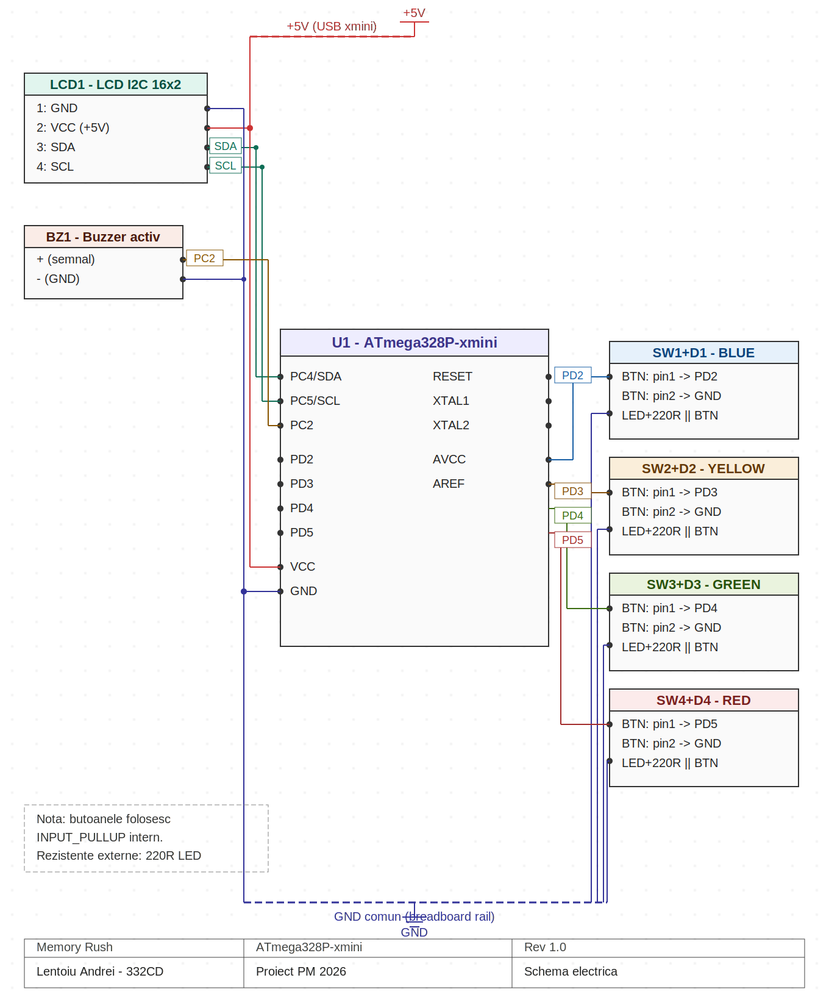
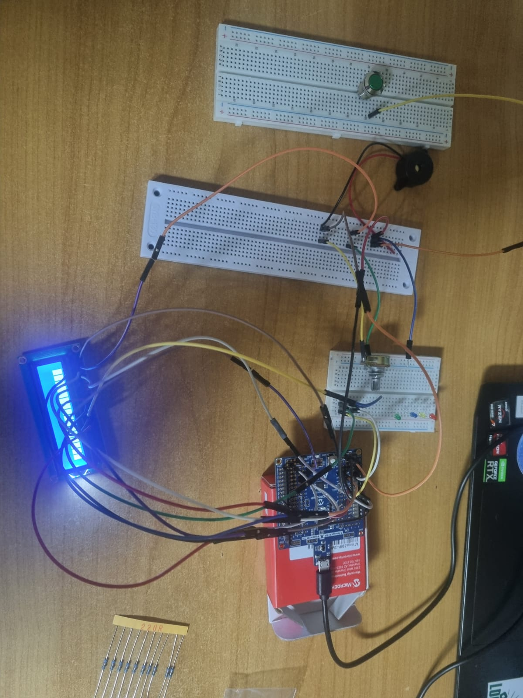
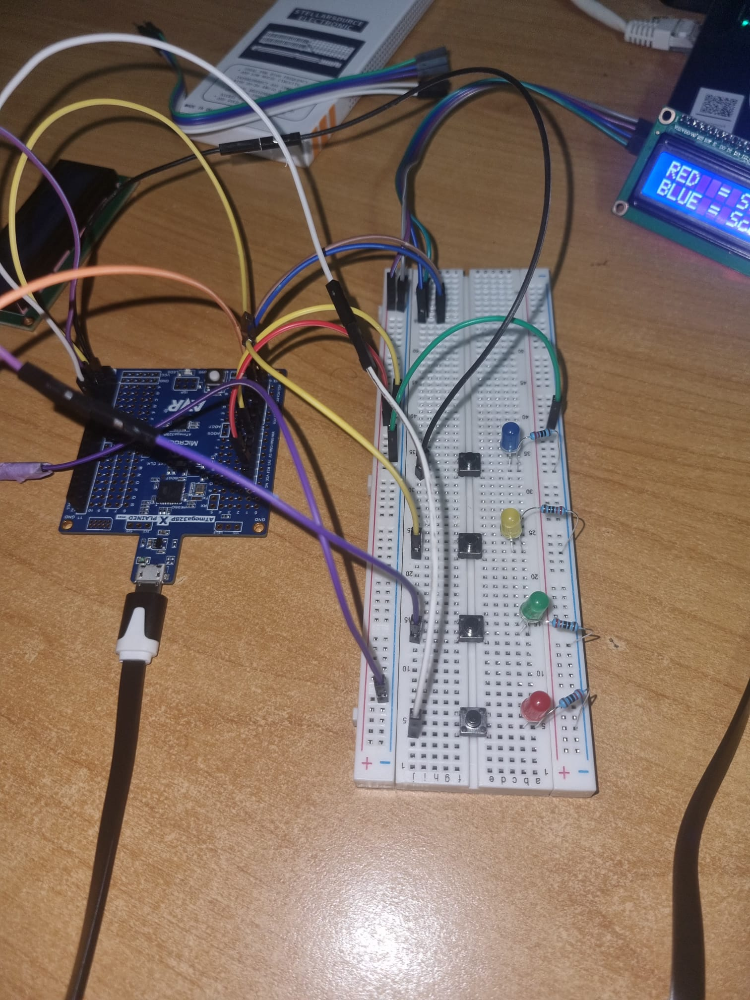

# Memory Rush - Proiect PM

Memory Rush este un joc de memorie si reflexe construit in jurul reproducerii unor secvente de culori contra cronometru, inspirat din clasicul "Simon Says". Proiectul este dezvoltat pe un microcontroler ATmega328P (placa xmini).

## Galerie si Prezentare

Mai jos regasiti o privire de ansamblu asupra evolutiei si realizarii proiectului, de la schema electrica pana la varianta finala functionala.

**Schema Electrica (KiCad):**

**Montaj Prototip:**

**Montaj Final:**

**Video Demo:**
Pentru a vedea cum ruleaza jocul in varianta finala, accesati linkul atasat.
### https://www.youtube.com/watch?v=fbTNCl3BuzY

---

## Cum se joaca

* Un LCD 16x2 afiseaza o secventa de culori, iar LED-urile se aprind in ordinea corespunzatoare pentru a ghida jucatorul.
* Jucatorul trebuie sa reproduca exact secventa apasand butoanele fizice colorate.
* Timpul de reactie este limitat la 8 secunde per actiune.
* O greseala sau expirarea timpului activeaza buzzerul, oprind instantaneu runda.
* Jocul mentine un clasament cu primele 5 scoruri (Highscores) salvat persistent in memoria EEPROM a microcontrolerului.

## Hardware Design

**Componente folosite:**
* ATmega328P-xmini
* LCD 16x2 I2C
* 4x Butoane (Rosu, Albastru, Verde, Galben)
* 4x LED-uri 3mm (Rosu, Albastru, Verde, Galben)
* Buzzer activ
* Rezistente 220 Ohm, fire de conexiune dupont, breadboards

### Pinout Sistem
* **Butoane (INPUT_PULLUP, Intreruperi Hardware):**
  * BLUE: D2 (INT0)
  * YELLOW: D3 (INT1)
  * GREEN: A3 (PCINT11)
  * RED: D5 (PCINT21)
* **LED-uri (OUTPUT):**
  * BLUE: D4
  * YELLOW: D6
  * GREEN: A0
  * RED: D7
* **Buzzer:** A2 (PC2)
* **LCD I2C:** SDA (A4), SCL (A5)

## Software Design

Firmware-ul este dezvoltat folosind PlatformIO. Codul este structurat pentru a fi rapid si non-blocant:
* **Intreruperi:** Citirea butoanelor se face strict prin intreruperi hardware (INT0, INT1, PCINT), eliminand complet conceptul de polling in bucla `loop()`.
* **Timere:** S-a renuntat complet la functia clasica `delay()`. Timer1 gestioneaza un ceas intern in milisecunde folosit pentru debounce si timpi limita, in timp ce Timer2 este folosit pentru a semnala in background greselile prin intermediul buzzer-ului activ.